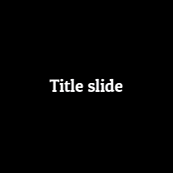
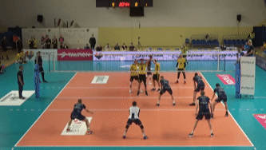

<!-- README.md is generated from README.Rmd. Please edit that file -->

# editry

<!-- badges: start -->

[](https://www.tidyverse.org/lifecycle/#experimental)
[](https://github.com/scienceuntangled/editry/actions/workflows/R-CMD-check.yaml)
<!-- badges: end -->

`editry` provides R bindings to
[editly](https://github.com/mifi/editly/), a “tool and framework for
declarative NLE (non-linear video editing) using Node.js and ffmpeg.
Editly allows you to easily and programmatically create a video from a
set of clips, images, audio and titles, with smooth transitions and
music overlaid.”

## Installation

``` r
install.packages("editry", repos = c("https://openvolley.r-universe.dev",
                                     "https://cloud.r-project.org"))
## or

## install.packages("remotes") ## if needed
remotes::install_github("scienceuntangled/editry")
```

Before `editry` can be used, you either need to install the `editly` npm
package, or to have docker running on your system with an `editly`
docker image pulled. You only need to do this once.

To install `editly` npm:

``` r
library(editry)
er_install_editly()
```

This will automatically install the system binaries for `node` (via
`noder::nr_install_node()`) and `ffmpeg` (via `er_install_ffmpeg()`) if
not already present on your system. (The `ffmpeg` installer only works
on Windows and Linux at this stage. On other platforms (e.g. Mac) you
will currently need to install `ffmpeg` yourself.)

Alternatively, install docker and pull an appropriate image, for
example:

``` sh
docker pull scienceuntangled/editly
```

(The `scienceuntangled/editly` docker image uses a modified version of
`editly`. Other `editly` docker images can be used, but will not support
the `logo_*` parameters in `er_header` or `er_spec`.)

## Example usage

The sequence of operations that editly performs to produce a video is
called an “edit spec”. See the [editly GitHub
page](https://github.com/mifi/editly/) for details and examples.

Typically a spec consists of a sequence of clips, along with some header
parameters that control aspects of the overall video. Each clip contains
one or more layers. Let’s start with two simple clips:

``` r
clips <- list(
    er_clip_title2(duration = 3, text = "Title slide",
                   transition = er_transition(name = "windowslice")),
    er_clip_image(duration = 3, zoom_direction = "out",
                  path = "https://jeroen.github.io/images/Rlogo.png"))
```

Now we can create the spec that defines all the steps required to build
the video:

``` r
outfile <- tempfile(fileext = ".mp4")
my_spec <- er_spec(clips = clips , out_path = outfile,
                   allow_remote_requests = TRUE)
## allow_remote_requests allows us to use a remote URL for the image source
```

And compile this into a video. We use the `fast` option here to generate
a low-quality preview:

``` r
er_exec_wait(spec = my_spec, fast = TRUE)
```

Note: if you are using `editly` via docker, use `er_exec_docker` instead
of `er_exec_wait`.



## Example 2

A clip from a video, with a bit of decoration added.

``` r
my_video <- "https://github.com/openvolley/ovdata/raw/master/inst/extdata/video/2019_03_01-KATS-BEDS-clip.mp4"
my_logo <- "https://github.com/openvolley/community/raw/master/docs/talks/common/ovlogo-blur.png"

clips <- list(
    ## the video segment
    er_clip_video(path = my_video, cut_from = 1, cut_to = 8),
    ## add an outro banner with logo
    er_clip(duration = 1.5, layers = list(er_layer_fill_color(),
                                          er_layer_image(path = my_logo))),
    ##  and a blank finishing screen
    er_clip_pause(duration = 0.25))

outfile <- tempfile(fileext = ".mp4")
my_spec <- er_spec(clips = clips, out_path = outfile,
                   allow_remote_requests = TRUE)
```


